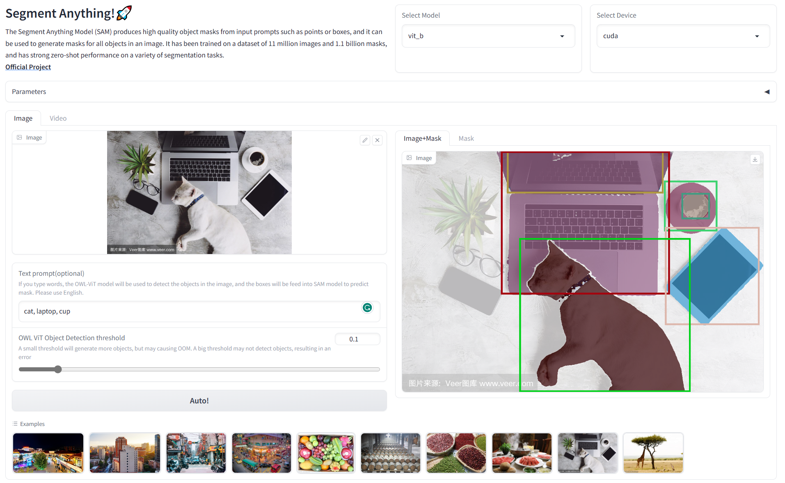

# Segment Anything WebUI

[[`Paper`](https://ai.facebook.com/research/publications/segment-anything/)] [[`Project`](https://segment-anything.com/)] [[`Demo`](https://segment-anything.com/demo)] [[`Dataset`](https://segment-anything.com/dataset/index.html)] [[`Blog`](https://ai.facebook.com/blog/segment-anything-foundation-model-image-segmentation/)] 

本项目是 Meta 最新成果 [Segment Anything Model](https://segment-anything.com/) 的简单 WebUI，基于 [Gradio](https://gradio.app/)。虽然官方有很好的 [demo](https://segment-anything.com/demo)，但也算是通过这么个简单的 UI 熟悉一下这个成果的用法。目前只实现了自动分割。



## **用法：**

- 安装 Segment Anything（[其他安装方式](https://github.com/facebookresearch/segment-anything#installation)）：

```
pip install git+https://github.com/facebookresearch/segment-anything.git
```

- `git clone` 本仓库：

```
git clone https://github.com/5663015/segment_anything_webui.git
```

- 在项目目录下新建 `checkpoints` 文件夹，将下载的模型文件放进去。模型文件下载：

  - **`default` or `vit_h`: [ViT-H SAM model.](https://dl.fbaipublicfiles.com/segment_anything/sam_vit_h_4b8939.pth)**

  - `vit_l`: [ViT-L SAM model.](https://dl.fbaipublicfiles.com/segment_anything/sam_vit_l_0b3195.pth)

  - `vit_b`: [ViT-B SAM model.](https://dl.fbaipublicfiles.com/segment_anything/sam_vit_b_01ec64.pth)

- 运行：

```
python app.py
```

**注意：**默认模型是 `vit_b`，笔记本 CPU 可运行。运行硬件默认是 `cuda`。

## TODO

- 增加 segmentation prompt 