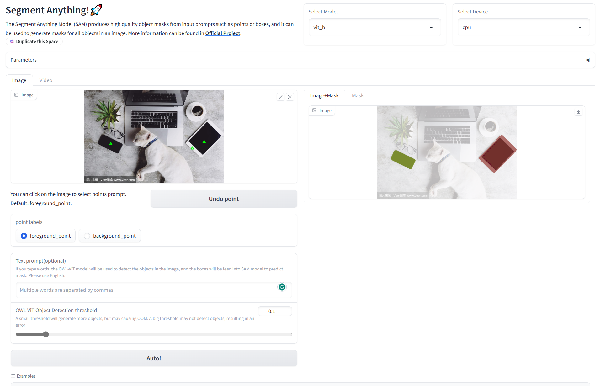

# Segment Anything WebUI

This project is based on **[Segment Anything Model](https://segment-anything.com/)** by Meta. The UI is based on [Gradio](https://gradio.app/). 

- Try deme on HF: [AIBoy1993/segment_anything_webui](https://huggingface.co/spaces/AIBoy1993/segment_anything_webui)
- [GitHub](https://github.com/5663015/segment_anything_webui)



## Change Logs

- [2023-4-11] 
  - Support **video segmentation**. A short video can be automatically segmented by SAM.
  - Support **text prompt segmentation using [OWL-ViT](https://huggingface.co/docs/transformers/v4.27.2/en/model_doc/owlvit#overview)** (Vision Transformer for Open-World Localization) model. [Text prompt  is not yet released](https://github.com/facebookresearch/segment-anything/issues/4) in the current SAM version, so it is implemented indirectly using OWL-ViT. 
- [2023-4-15]
  - Support **points prompt segmentation**. But due to [this issue](https://github.com/facebookresearch/segment-anything/issues/111), using text and point prompts together may result in an error. 
  - About **boxes prompt**, it does not seem possible to draw the box directly in Gradio. One idea is to use two points to represent the box, but this is not accurate or elegant. Also, text prompt implements box prompt indirectly, so I won't implement box prompt directly for now. If you have any ideas about box-drawing in Gradio, please tell me.


## **Usage**

Following usage is running on your computer. 

- Install Segment Anything（[more details about install Segment Anything](https://github.com/facebookresearch/segment-anything#installation)）：

```
pip install git+https://github.com/facebookresearch/segment-anything.git
```

- `git clone` this repository：

```
git clone https://github.com/5663015/segment_anything_webui.git
```

- Make a new folder named `checkpoints` under this project，and put the downloaded weights files in `checkpoints`。You can download the weights using following URLs：

  - `vit_h`: [ViT-H SAM model](https://dl.fbaipublicfiles.com/segment_anything/sam_vit_h_4b8939.pth)

  - `vit_l`: [ViT-L SAM model](https://dl.fbaipublicfiles.com/segment_anything/sam_vit_l_0b3195.pth)

  - `vit_b`: [ViT-B SAM model](https://dl.fbaipublicfiles.com/segment_anything/sam_vit_b_01ec64.pth)

- Under `checkpoints`, make a new folder named `models--google--owlvit-base-patch32`, and put the downloaded [OWL-ViT weights](https://huggingface.co/google/owlvit-base-patch32) files in `models--google--owlvit-base-patch32`. 
- Run：

```
python app.py
```

**Note：** Default model is `vit_b`，the demo can run on CPU. Default device is `cpu`。

## TODO

- [x] Video segmentation

- [x] Add text prompt

- [x] Add points prompt

- [ ] ~~Add boxes prompt~~

- [ ] Try to combine with ControlNet and Stable Diffusion. Use SAM to generate dataset for fine-tuning ControlNet, and generate new image with SD. 

## Reference

- Thanks to the wonderful work [Segment Anything](https://segment-anything.com/) and [OWL-ViT](https://arxiv.org/abs/2205.06230)
- Some video processing code references [kadirnar/segment-anything-video](https://github.com/kadirnar/segment-anything-video), and some OWL-ViT code references [ngthanhtin/owlvit_segment_anything](https://github.com/ngthanhtin/owlvit_segment_anything).

